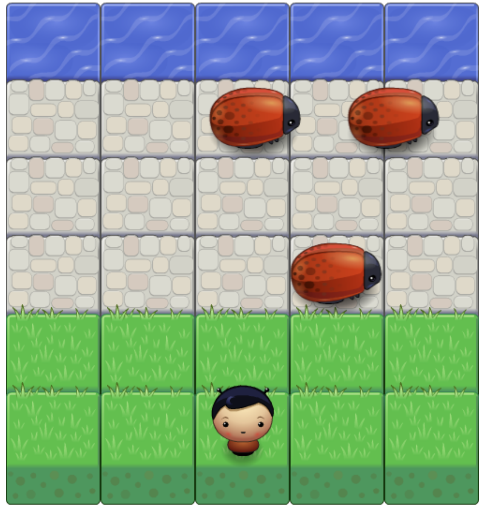

# A classic frogger arcade game

## How to run game

Navigate to project folder and click on index.html file. You should see a page similar to the picture shown above in your browser and then enjoy the game.

## How to play game

The following instructions is adapted from [Udacity frontend arcade game project](https://github.com/udacity/frontend-nanodegree-arcade-game)

>In this game you have a Player and Enemies (Bugs). The goal of the player is to reach the water, without colliding into any one
of the enemies. The player can move left, right, up and down. The enemies move in varying speeds on the paved block portion of
the scene. Once a the player collides with an enemy, the game is reset and the player moves back to the start square. Once the
player reaches the water the game is won.
